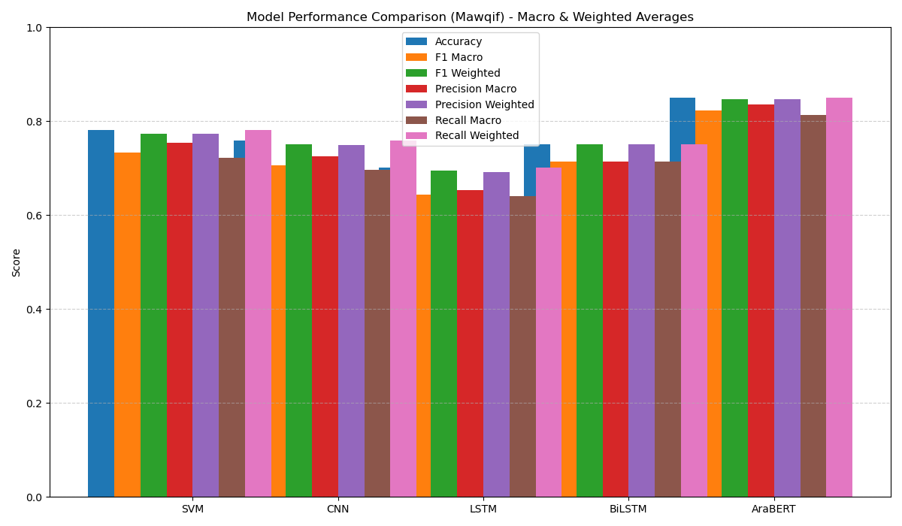

# DeepL: Arabic Stance Detection with Classical and Transformer Models

This project compares the performance of classical and deep learning models—including SVM, CNN, LSTM, BiLSTM, and AraBERT—on two Arabic stance detection datasets: **Mawqif** and **Arastance**.

---

## Mawqif Results

### Model Performance Chart



### Metrics Table

| Model | Accuracy | F1 Macro | F1 Weighted | Precision Macro | Precision Weighted | Recall Macro | Recall Weighted |
|---|---|---|---|---|---|---|---|
| SVM | 0.7808 | 0.7335 | 0.7735 | 0.7542 | 0.7737 | 0.7224 | 0.7808 |
| CNN | 0.7587 | 0.7057 | 0.7502 | 0.7256 | 0.7496 | 0.6959 | 0.7587 |
| LSTM | 0.7019 | 0.6444 | 0.6953 | 0.6527 | 0.6918 | 0.6398 | 0.7019 |
| BiLSTM | 0.7508 | 0.7145 | 0.7508 | 0.7145 | 0.7508 | 0.7145 | 0.7508 |
| AraBERT | 0.8502 | 0.8228 | 0.8476 | 0.8354 | 0.8477 | 0.8135 | 0.8502 |

---

## Arastance Results

### Model Performance Chart


### Metrics Table

| Model | Accuracy | F1 Macro | F1 Weighted | Precision Macro | Precision Weighted | Recall Macro | Recall Weighted |
|---|---|---|---|---|---|---|---|
| SVM | 0.7561 | 0.6790 | 0.7364 | 0.7712 | 0.7658 | 0.6451 | 0.7561 |
| CNN | 0.7683 | 0.6961 | 0.7576 | 0.7250 | 0.7570 | 0.6810 | 0.7683 |
| LSTM | 0.5549 | 0.2379 | 0.3960 | 0.1850 | 0.3079 | 0.3333 | 0.5549 |
| BiLSTM | 0.6951 | 0.6270 | 0.6977 | 0.6690 | 0.7264 | 0.6193 | 0.6951 |
| AraBERT | 0.7744 | 0.7028 | 0.7626 | 0.7471 | 0.7704 | 0.6799 | 0.7744 |

---

## Model Comparison Summary

- **AraBERT** consistently outperforms classical and RNN models on both datasets, especially in F1 and accuracy.
- **CNN** and **SVM** are strong baselines, but deep models (BiLSTM, AraBERT) generally achieve higher scores.
- **LSTM** underperforms compared to BiLSTM and CNN, especially on Arastance.
- Macro and weighted metrics provide a fair view of model performance across imbalanced classes.

---

## How to Run

1. Install dependencies:
   ```bash
   pip install -r requirements.txt
   ```
2. Run the scripts:
   ```bash
   python Mawqif_only.py
   python Arastance_only.py
   ```

## How to Interpret

- **Accuracy**: Overall correctness of the model.
- **Precision**: How many selected items are relevant.
- **Recall**: How many relevant items are selected.
- **F1-score**: Harmonic mean of precision and recall.
- **Macro avg**: Average metric across classes, treating all classes equally.
- **Weighted avg**: Average metric across classes, weighted by support (number of true instances per class).

## References
- [AraBERT: Transformer-based Model for Arabic NLP](https://github.com/aub-mind/arabert)
- [Project GitHub Repo](https://github.com/aliengemn1/DeepL) 