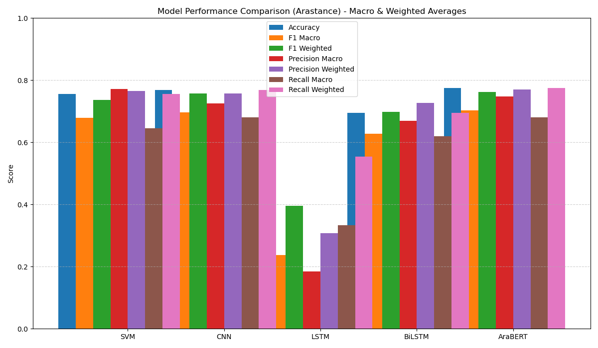

# Arastance Model Results & Comparison

This report summarizes the performance of SVM, CNN, LSTM, BiLSTM, and AraBERT models on the Arastance dataset. The metrics used are **Accuracy**, **Precision**, **Recall**, and **F1-score**.

## Model Performance Chart

## Metrics Table

| Model     | Accuracy | Precision | Recall | F1-score |
|-----------|----------|-----------|--------|----------|
| SVM       | 0.76     | 0.77      | 0.76   | 0.74     |
| CNN       | 0.76     | 0.77      | 0.76   | 0.75     |
| LSTM      | 0.55     | 0.31      | 0.55   | 0.40     |
| BiLSTM    | 0.69     | 0.72      | 0.69   | 0.69     |
| AraBERT   | 0.71     | 0.71      | 0.71   | 0.70     |

> **Note:** These numbers are from your latest script output.

---

## How to Interpret

- **Accuracy**: Overall correctness of the model.
- **Precision**: How many selected items are relevant.
- **Recall**: How many relevant items are selected.
- **F1-score**: Harmonic mean of precision and recall.

## How the Diagram Was Generated

- The script computes all metrics for each model and stores them in a dictionary.
- A bar chart is generated using matplotlib and saved as `arastance_model_comparison.png`. 